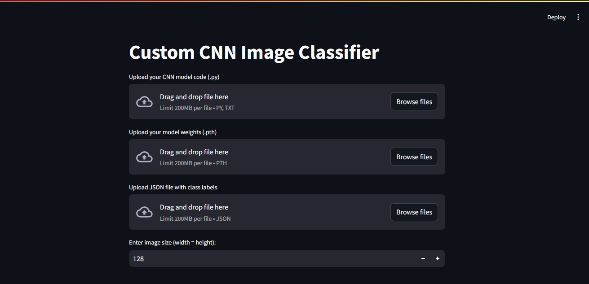
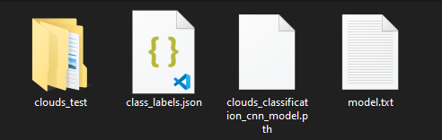
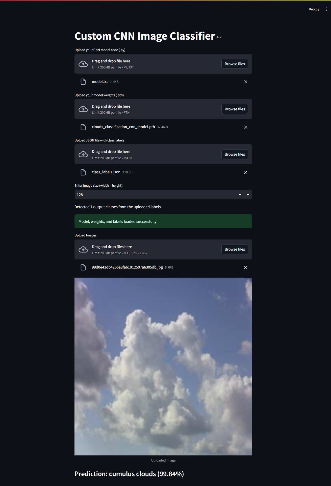

# CNN Image Classifier App

This is a custom image classification web application built using **Streamlit**, **PyTorch**, and a **Convolutional Neural Network (CNN)** model. The app allows users to upload a trained CNN model and class labels (in JSON format), and then use the model to classify images.

The app provides the following functionalities:

- Upload a trained CNN model and its corresponding class labels.
- Specify the image size to resize the uploaded images.
- Upload images for classification.
- Display the prediction result along with the classification probability.



## Features

- **Upload CNN Model:** Users can upload their trained CNN model in `.pt` or `.pth` format.
- **Upload Class Labels:** Users can upload a JSON file containing class labels for the model.
- **Image Classification:** After uploading an image, the app will classify it based on the trained model and show the class label and the prediction probability.

## Project Architecture :

```bash
cnn_image_classifier_app/
├── imgs/            # Images
├── Example/         # examples folder
├── app.py           # Streamlit app
├── requirements.txt     # Dependencies
│── README.md
```

## Requirements

To run the app locally, you need to install the following dependencies:

- Python 3.x
- PyTorch
- Streamlit
- Pillow
- JSON

## Installation

1. Clone the repository:

    ```bash
    git clone https://github.com/drisskhattabi6/CNN-Image-Classifier-App.git
    ```

2. Navigate to the project directory:

    ```bash
    cd CNN-Image-Classifier-App
    ```

3. Install the required dependencies:

    ```bash
    pip install -r requirements.txt
    ```

## Usage

1. Run the Streamlit app:

    ```bash
    streamlit run app.py
    ```

2. The app will open in your web browser at `http://localhost:8501`.

3. **CNN model (Architecture)**:
    - the CNN model (Architecture) must be saved in a file with the `.py` or `.txt` extension.

4. **Upload the trained model**:
   - Upload your PyTorch model (`.pt` or `.pth` file).
   - The model should be compatible with the app's architecture.

5. **Upload the class labels JSON**:
   - Upload the JSON file containing the class labels in the format:

     ```json
     {
         "0": "CLASS_NAME_1",
         "1": "CLASS_NAME_2", 
         ...
     }
     ```

6. **Enter the image size**:
   - Specify the desired image size for classification (default is 128).
   - The image size should be the same as the one used for training the CNN model.

7. **Upload images for classification**:
   - Upload one or more images (JPEG, PNG, or JPG).
   - The app will display the uploaded image and show the predicted class along with the probability.

## Saving the CNN Model and Class Labels

### Save Class Labels in a JSON File

To ensure consistency between the training and inference phases, class labels must be saved in a JSON file. Below is the correct way to save class labels from your dataset:

```python
import json

# Get class labels
class_labels = {v: k for k, v in dataset_train.class_to_idx.items()}  # Convert to index-to-class mapping
print(class_labels)

# Save to JSON file
with open("class_labels.json", "w") as json_file:
    json.dump(class_labels, json_file, indent=4)
```

### Save the Trained CNN Model

Once the CNN model is trained, its weights should be saved to a file so it can be loaded later for predictions:

```python
import torch

torch.save(cnn_model.state_dict(), 'cnn_model.pth')
```

To reload the model for inference, ensure the architecture is defined before loading the saved weights.

## Example

there is a folder contains 2 examples of the cnn models and the corresponding class labels, you can use them to test the app.





## Troubleshooting

- **JSON Decode Error**: If you encounter a `JSONDecodeError`, ensure the uploaded JSON file is correctly formatted and contains valid data.
- **KeyError**: Ensure that the class labels JSON file has the correct format and that the model output matches the expected labels.
